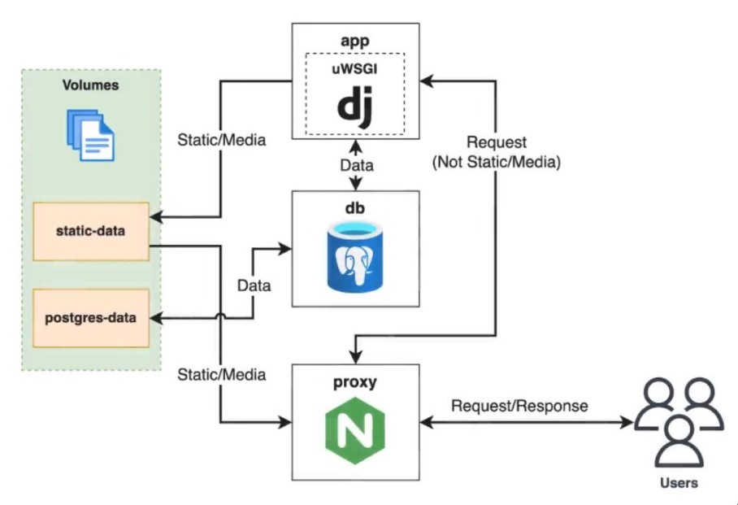

# Recipe API
[](https://github.com/FlashDrag/recipe-app-api/actions) [](http://ec2-34-254-224-163.eu-west-1.compute.amazonaws.com/api/docs)

<!-- [](http://ec2-34-254-224-163.eu-west-1.compute.amazonaws.com/api/docs) -->

REST API for managing recipes. Built with Python, Django REST Framework and Docker using Test Driven Development (TDD). Deployed on AWS EC2.

_AWS EC2 Instance is temporarily stopped to save costs._

http://ec2-34-254-224-163.eu-west-1.compute.amazonaws.com/api/docs

## Table of Contents
- [Features](#features)
- [Documentation](#documentation)
    - [User authentication with Token](#user-authentication-with-token)
    - [Swagger UI](#swagger-ui)
    - [Frontend App](#frontend-app)
- [Entity-Relationship Diagram](#entity-relationship-diagram)
- [Technologies Used](#technologies-used)
- [Local Usage](#local-usage)
- [Local Development Environment Setup (Ubuntu 22.04)](#local-development-environment-setup-ubuntu-2204)
    - [Prerequisites](#prerequisites)
    - [Django Setup](#django-setup)
    - [Database Setup](#database-setup)
        - [Configure Docker for PostgreSQL](#configure-docker-for-postgresql)
        - [Configure Django to use PostgreSQL](#configure-django-to-use-postgresql)
            - [Setup `wait_for_db` custom management command](#setup-wait_for_db-custom-management-command)
        - [Create a Custom User Model](#create-a-custom-user-model)
        - [Configure DRF to use drf_spectacular](#configure-drf-to-use-drf_spectacular)
        - [Configure Static and Media Files for Local Development](#configure-static-and-media-files-for-local-development)
    - [Local Development](#local-development)
        - [1. VSCode dev container](#1-vscode-dev-container)
        - [2. Local virtual environment](#2-local-virtual-environment)
- [GitHub Actions](#github-actions)
    - [Docker Hub Configuration](#docker-hub-configuration)
    - [GitHub Actions Configuration](#github-actions-configuration)
- [Deployment (AWS EC2)](#deployment-aws-ec2)
    - [Prerequisites](#prerequisites-1)
    - [Project Configuration](#project-configuration)
        - [Add uWSGI to the project](#add-uwsgi-to-the-project)
        - [Proxy configuration](#proxy-configuration)
        - [Handle configuration with environment variables](#handle-configuration-with-environment-variables)
        - [Docker Compose configuration for deployment](#docker-compose-configuration-for-deployment)
        - [Update Django settings to use environment variables](#update-django-settings-to-use-environment-variables)
    - [AWS EC2 Configuration](#aws-ec2-configuration)
- [Useful Commands](commands.md)

## Features
- Django UI admin panel
    ```<host>/admin/```

- Token-based authentication
- User management
    * Create user
    * Update user *(auth required)*
    * Get user detail *(auth required)*

- Recipe management *(auth required)*
    - Recipe API
        * View list of recipes
        * View detail of specific recipe
        * Create recipe
        * Update recipe
        * Delete recipe
    - Tags API
        * View list of tags
        * Create tags
            - Tags can be created when creating a recipe
            - Tags can be created when updating a recipe
        * Update tag
            - Tags can be updated when updating a recipe
            - Tag can be updated using the Tags API endpoint
        * Delete tag
    - Ingredients API
        * View list of ingredients
        * Create ingredients
            - Ingredients can be created when creating a recipe
            - Ingredients can be created when updating a recipe
        * Update ingredient
            - Ingredients can be updated when updating a recipe
            - Ingredient can be updated using the Ingredients API endpoint
        * Delete ingredient
    - Recipe Image API
        * Upload image to recipe
- Filter recipes by tags and ingredients
    - How to use:
        - `<host>/api/recipes/?tags=<comma_separated_tag_ids>`
        - `<host>/api/recipes/?ingredients=<comma_separated_ingredient_ids>`


[Back to top ↑](#recipe-api)

## Documentation
The API documentation is created using [drf-spectacular](https://drf-spectacular.readthedocs.io/en/latest/).
- Swagger UI: `/api/docs/`
- ReDoc: `/api/redoc/`
- OpenAPI schema: `/api/schema/`

#### User authentication with Token
- Create new user or use existing one
- To get a token, send a `POST` request to `<host>/api/user/token/` with the following payload:
    ```json
    {
        "email": "<user_email>",
        "password": "<user_password>"
    }
    ```
- ##### Swagger UI
    - Copy the token from the response
    - Click on the *Authorize* button in the top right corner
    - Enter the `Token <token>` in the *Value* field of the *tokenAuth (apiKey)* section
- ##### Frontend App
    - Save the token in the local storage
    - Add the `Authorization: Token <token>` header to the request every time you make a request to the API

[Back to top ↑](#recipe-api)

## Entity-Relationship Diagram


## Technologies Used
### Programming Languages
- [Python](https://www.python.org/)

### Frameworks
- [Django](https://www.djangoproject.com/) - Python web framework
- [Django REST Framework](https://www.django-rest-framework.org/) - Django toolkit for building web APIs

### Libraries
- [flake8](https://flake8.pycqa.org/en/latest/) - Python linting tool
- [psycopg2](https://www.psycopg.org/) - PostgreSQL database adapter for Python
- [drf-spectacular](https://drf-spectacular.readthedocs.io/en/latest/) - OpenAPI schema generation for Django REST framework

### Tools
#### Development
- [VS Code](https://code.visualstudio.com/) - IDE

#### Version Control
- [Git](https://git-scm.com/) - Version control system
- [GitHub](https://github.com/) - Version control system hosting service

#### Containerization
- [Docker](https://www.docker.com/) - Containerization platform
- [Docker Compose](https://docs.docker.com/compose/) - Tool for defining and running multi-container Docker applications
- [Docker Hub](https://hub.docker.com/) - Container image registry

#### Deployment
- [AWS EC2](https://aws.amazon.com/ec2/) - Virtual machine service
- [nginx](https://www.nginx.com/) - Web server
- [uWSGI](https://uwsgi-docs.readthedocs.io/en/latest/) - Web server gateway interface


[Back to top ↑](#recipe-api)

## Local Usage
- Clone the GitHub repository
    ```bash
    $ git clone
    ```
- Build the docker image
    ```bash
    $ docker compose build
    ```
- Run the containers
    ```bash
    $ docker compose up
    ```

## Local Development Environment Setup (Ubuntu 22.04)
##### Prerequisites
- Install Docker Engine

    https://docs.docker.com/engine/install/ubuntu/
- Install Docker Compose V2

    https://docs.docker.com/compose/install/linux/#install-using-the-repository
- Manage Docker as a non-root user(grand the user access to the docker command without needing to use sudo)

    https://docs.docker.com/engine/install/linux-postinstall/
- Clone the GitHub repository
    ```bash
    $ git clone git@github.com:FlashDrag/recipe-app-api.git <path_to_local_dir>
    ```

### Django Setup
- Create requirements.txt file and add the following:
    ```
    Django>=3.2.4,<3.3
    djangorestframework>=3.12.4,<3.13
    ```
- Create an empty `app` folder
- Configure linting with flake8
    - Create `requirements.dev.txt`. Dev requirements are only needed for development and testing in the local environment.
        ```
        flake8>=3.9.2,<3.10
        ```
    - Create `.flake8` file inside `app` folder and add the following:
        ```bash
        [flake8]
        exclude =
            migrations,
            __pycache__,
            manage.py,
            settings.py
        ```
- Create Dockerfile file and add the following:
```bash
# python image from docker hub
# alpine is an efficient and lightweight linux distro for docker
FROM python:3.11.6-alpine3.18

# maintainer of the image
LABEL maintainer="linkedin.com/in/pavlo-myskov"

# tells python to run in unbuffered mode.
# The output will be printed directly to the terminal
ENV PYTHONUNBUFFERED 1

# copy requirements.txt from local machine into docker image
COPY ./requirements.txt /tmp/requirements.txt
# copy the dev requirements file from local machine into docker image
COPY ./requirements.dev.txt /tmp/requirements.dev.txt
# copy the app folder from local machine into docker image
COPY ./app /app
# set the working directory.
# All subsequent commands will be run from this directory
WORKDIR /app
# Expose port 8000 from the container to outside world(our localhost)
# It allows us to access the port from our web browser
EXPOSE 8000

# set default environment variable
ARG DEV=false
# RUN - is a command to execute when building the image
# python -m venv /py - creates a virtual environment in the /py directory
# ... --upgrade pip - upgrades pip
# .. /tmp/requirements.txt - installs all the requirements
# rm -rf /tmp - removes the temporary directory
# adduser - creates a user inside the docker image(best practice to not run as root)
# --disabled-password - disables the password for the user
# --no-create-home - does not create a home directory for the user
# --django-user - name of the user
# chown -R django-user:django-user /app - changes the ownership of the /app directory to django-user
RUN python -m venv /py && \
    /py/bin/pip install --upgrade pip && \
    /py/bin/pip install -r /tmp/requirements.txt && \
    if [ "$DEV" = "true" ] ; \
        then /py/bin/pip install -r /tmp/requirements.dev.txt ; \
    fi && \
    rm -rf /tmp && \
    adduser \
        --disabled-password \
        --no-create-home \
        django-user && \
    chown -R django-user:django-user /app

# update PATH environment variable to include the /py/bin directory
# so that we can run python commands without specifying the full path
ENV PATH="/py/bin:$PATH"

# specify the user that we're switching to
USER django-user

```
- Create `.dockerignore` file and add the following:
```bash
# Git
.git
.gitignore

# Docker
.docker

# Python
app/__pycache__/
app/*/__pycache__/
app/*/*/__pycache__/
app/*/*/*/__pycache__/
.env/
.venv/
venv/
```
- Build the docker image (optionally, as we're going to use docker-compose)
    ```bash
    $ sudo service docker start
    $ docker build .
    ```
- Create docker-compose.yml file and add the following:
```bash
# version of docker-compose syntax
version: '3.9'

# define services
services:
  # name of the service
  app:
    build:
      # path to the Dockerfile
      context: .
      # override the default environment variable
      args:
        - DEV=true
    # port mapping. Maps port 8000 on the host to port 8000 on the container
    ports:
      - '8000:8000'
    # volumes to mount. Mounts the app directory on the host to the /app directory on the container.
    # Maps directory in the container to the directory on the local machine
    volumes:
      - ./app:/app
      # `- ./app:/home/django-user/app` - for dev container development
    # command to run when the container starts
    command: >
      sh -c 'python manage.py runserver 0.0.0.0:8000'
    environment:
      - DEBUG=1
```
- Build the docker image
    ```bash
    $ docker compose build
    ```
- Create a Django project
    ```bash
    $ docker compose run --rm app sh -c "django-admin startproject app ."
    ```
- Start the Django development server
    ```bash
    $ docker compose up
    ```

[Back to top ↑](#recipe-api)

### Database Setup
#### Configure Docker for PostgreSQL
- Add PostgreSQL database to docker-compose.yml file
```bash
# ...
services:
    app:
        # specifies that the app service depends on the db service
        # also, it ensures that the db service is started before the app service
        depends_on:
            - db
        # ...
        # allows to connect to the database from the app service,
        # must match the credentials in the db service
        environment:
            # hostname of the database - the name of the service in docker-compose.yml file
            - DB_HOST=db
            - DB_NAME=devdb
            - DB_USER=devuser
            - DB_PASS=postgres

    # add db service,
    # `app` service will use `db` as a hostname to connect to the database
    db:
        # docker hub image to use
        image: postgres:13-alpine
        volumes:
            - dev-db-data:/var/lib/postgresql/data/
        environment:
            - POSTGRES_DB=devdb
            - POSTGRES_USER=devuser
            - POSTGRES_PASSWORD=postgres
        ports:
        - '5432:5432'

# named volumes
volumes:
    dev-db-data:
    dev-static-data:
```
- Run the containers to create the database
```bash
    $ docker compose up
```
- Add `psycopg2` dependencies to Dockerfile
```bash
# ...
RUN python -m venv /py && \
    /py/bin/pip install --upgrade pip && \
    # install psycopg2 dependencies
    apk add --update --no-cache postgresql-client && \
    apk add --update --no-cache --virtual .tmp-build-deps \
        build-base postgresql-dev musl-dev && \
    # ...
    rm -rf /tmp && \
    # delete the .tmp-build-deps
    apk del .tmp-build-deps && \
    # ...
```
- Add `psycopg2` package to requirements.txt file
```
psycopg2>=2.8.6,>2.9
```
#### Configure Django to use PostgreSQL
- Add database configuration to settings.py file
```
# Database

DATABASES = {
    'default': {
        'ENGINE': 'django.db.backends.postgresql',
        'NAME': os.environ.get('DB_NAME'),
        'USER': os.environ.get('DB_USER'),
        'PASSWORD': os.environ.get('DB_PASS'),
        'HOST': os.environ.get('DB_HOST'),
    }
}
```
- Add database credentials to *.env* file. See the See the [.env.example](.env.example) file for reference.
- Rebuild the docker image
```bash
$ docker compose up --build
```
##### Setup `wait_for_db` custom management command
Allows to wait for the database to be available before running the Django app.
- Create a new *core* app
```bash
$ docker compose run --rm app sh -c "python manage.py startapp core"
```
- Create a new *management* module with *commands* subdirectory inside *core* app
```bash
$ mkdir -p app/core/management/commands && touch app/core/management/__init__.py && touch app/core/management/commands/__init__.py
```
- Create a new *wait_for_db.py* file inside *commands* subdirectory
```bash
$ touch app/core/management/commands/wait_for_db.py
```
- Configure *wait_for_db.py* file. See the [file](app/core/management/commands/wait_for_db.py) for reference.
- Add *wait_for_db* command to *docker-compose.yml* file
```
# ...
services:
    app:
        # ...
        # command to run when the container starts
        command: >
            sh -c "python manage.py wait_for_db &&
                    python manage.py migrate &&
                    python manage.py runserver 0.0.0.0:8000"
```
- Clean up the containers
```bash
$ docker compose down
```
- Run the containers (optionally, for testing)
It is better first time to migrate the database after the *CustomUser* model has been created.
```bash
$ docker compose up
```
#### Create a Custom User Model
- Create a Custom User Model and a Custom User Manager. See the [file](app/core/models.py) for reference.
- Add `AUTH_USER_MODEL = 'core.User'` to *settings.py* file
- Make and apply migrations
```bash
$ docker compose run --rm app sh -c "python manage.py makemigrations core"
$ docker compose run --rm app sh -c "python manage.py wait_for_db && python manage.py migrate"
```
- Remove the db volume
In case, if you applied initial migrations before creating the Custom User Model. It will clean up the database.
```bash
$ docker volume rm recipe-app-api_dev-db-data
```
#### Configure DRF to use drf_spectacular
It allows to generate OpenAPI schema for the API.
- Add `drf_spectacular` package to requirements.txt file
- Add `rest_framework` and `drf_spectacular` to *INSTALLED_APPS* in *settings.py* file
- Add `REST_FRAMEWORK = {'DEFAULT_SCHEMA_CLASS': 'drf_spectacular.openapi.AutoSchema',}` to *settings.py* file
- Add url patterns to *urls.py* file
```python
from drf_spectacular.views import (
    SpectacularAPIView,
    SpectacularSwaggerView
)
# ...

urlpatterns = [
    # ...
    path('api/schema/', SpectacularAPIView.as_view(), name='api-schema'),
    path(
        'api/docs',
        SpectacularSwaggerView.as_view(url_name='api-schema'),
        name='api-docs',
    )
]
```
- Rebuild the docker image

#### Configure Static and Media Files for Local Development
- Add image handling dependencies (jpeg-dev, zlib zlib-dev) to Dockerfile
-  Create static and media directories and set permissions
```
# ...
RUN python -m venv /py && \
    # ...
    apk add --update --no-cache postgresql-client jpeg-dev && \
    # ...
        build-base postgresql-dev musl-dev zlib zlib-dev && \
    # ...
    adduser \
        # ...
        django-user && \
    mkdir -p /vol/web/media && \
    mkdir -p /vol/web/static && \
    # set ownership of the directories to django-user
    chown -R django-user:django-user /vol && \
    # set permissions, so that the user can make any changes to the directories
    chmod -R 755 /vol
```
- Add `Pillow` package to requirements.txt file
- Add new volumes to docker-compose.yml file
```
# ...
services:
    app:
        # ...
        volumes:
            - ./app:/app
            - dev-static-data:/vol/web
# ...
volumes:
    dev-db-data:
    dev-static-data:
```
- Update settings.py file
```
STATIC_URL = '/static/static/'
MEDIA_URL = '/static/media/'

MEDIA_ROOT = '/vol/web/media'
STATIC_ROOT = '/vol/web/static'
```
- Update urls.py file
```
from django.conf.urls.static import static
from django.conf import settings
# ...

if settings.DEBUG:
    urlpatterns += static(
        settings.MEDIA_URL,
        document_root=settings.MEDIA_ROOT,
    )
```
- Rebuild the docker image
- Add `recipe_image_file_path` function and `image` field to *models.py* file


[Back to top ↑](#recipe-api)

### Local Development
Choose one of the following options:
#### 1. [VSCode dev container](dev_container.md)
Allows to develop the application inside a container using VSCode.

#### 2. Local virtual environment
Since you've mounted your app codebase as a Docker volume you can develop your application directly on your local machine and see the changes reflected in the container without having to rebuild the container.
##### Setup Local Virtual Environment
- Create virtual environment using virtualwrapper
    ```bash
    $ mkvirtualenv recipe-app-api
    ```
- Install requirements
    ```bash
    $ pip install -r requirements.txt
    ```
- Install dev requirements
    ```bash
    $ pip install -r requirements.dev.txt
    ```
- All development dependencies you can add to `requirements.dev.txt` file.
- **Make sure the all dependencies including python version on your local machine match the dependencies in the container to avoid any issues.**

[Back to top ↑](#recipe-api)

## GitHub Actions
### Docker Hub Configuration
DockerHub is a platform that allows us to pull Docker images down to our local machine and push Docker images up to the cloud.

- Docker Hub account
    https://hub.docker.com/
- Create New Access Token
    - Go to https://hub.docker.com/ > Account Settings > Security > New Access Token
    - Token Description: `recipe-app-api-github-actions`
    - Access permissions: `read-only`
    - Don't close token, until you've copied and pasted it into your GitHub repository

    - Warning: Use different tokens for different environments
    - To use access token from your Docker CLI client(at the password prompt use the access token as the password)
        ```bash
        $ docker login -u <username>
        ```

### GitHub Actions Configuration
- Create new repo if not exists
- Add Docker Hub secrets to GitHub repository for GitHub Actions jobs

    _Settings > Secrets > Actions > New repository secret_

    - `DOCKERHUB_USER`: `<username>`

    - `DOCKERHUB_TOKEN`: `<access_token>`
- Create a config file at `.github/workflows/checks.yml`
```bash
---
name: Checks

on: [push]

jobs:
  test-lint:
    name: Test and Lint
    runs-on: ubuntu-22.04
    steps:
      - name: Login to Docker Hub
        uses: docker/login-action@v3
        with:
          username: ${{ secrets.DOCKERHUB_USER }}
          password: ${{ secrets.DOCKERHUB_TOKEN }}
      - name: Checkout
        uses: actions/checkout@v4
      - name: Test
        run: docker compose run --rm app sh -c "python manage.py wait_for_db && python manage.py test"
      - name: Lint
        run: docker compose run --rm app sh -c "flake8"
```

[Back to top ↑](#recipe-api)

## Deployment (AWS EC2)
### Prerequisites
- AWS account
- AWS CLI
- nginx.
Web server that can be used as a reverse proxy to the Django app
- uWSGI or Gunicorn.
Web server gateway interface that can be used to serve the Django app
- Docker Compose

*Project diagram*


### Project Configuration
#### Add uWSGI to the project
- Update Dockerfile.
```
COPY ./scripts /scripts
COPY ./app /app

RUN ...
    # linux-headers - required for uWSGI
    build-base postgresql-dev musl-dev zlib zlib-dev linux-headers && \
    # ...
    chmod -R 755 /vol && \
    # make the scripts dir executable
    chmod -R +x /scripts

# update PATH environment variable
ENV PATH="/scripts:/py/bin:$PATH"
# ...
# run the script that will run the uWSGI server
CMD ["run.sh"]
```
- Create `scripts` directory and add `run.sh` file
```
#!/bin/sh

set -e

python manage.py wait_for_db
python manage.py collectstatic --noinput
python manage.py migrate

uwsgi --socket :9000 --workers 4 --master --enable-threads --module app.wsgi
```
- Add `uwsgi` package to requirements.txt file
```
uwsgi>=2.0.19<2.1
```
#### Proxy configuration
- Create `proxy` directory
- Add `default.conf.tpl` file
```
server {
    listen ${LISTEN_PORT};

    location /static {
        alias /vol/static;
    }

    location / {
        uwsgi_pass              ${APP_HOST}:${APP_PORT};
        include                 /etc/nginx/uwsgi_params;
        client_max_body_size    10M;
    }
}
```
- Add `uwsgi_params` file

https://uwsgi-docs.readthedocs.io/en/latest/Nginx.html#what-is-the-uwsgi-params-file
```
uwsgi_param QUERY_STRING $query_string;
uwsgi_param REQUEST_METHOD $request_method;
uwsgi_param CONTENT_TYPE $content_type;
uwsgi_param CONTENT_LENGTH $content_length;
uwsgi_param REQUEST_URI $request_uri;
uwsgi_param PATH_INFO $document_uri;
uwsgi_param DOCUMENT_ROOT $document_root;
uwsgi_param SERVER_PROTOCOL $server_protocol;
uwsgi_param REMOTE_ADDR $remote_addr;
uwsgi_param REMOTE_PORT $remote_port;
uwsgi_param SERVER_ADDR $server_addr;
uwsgi_param SERVER_PORT $server_port;
uwsgi_param SERVER_NAME $server_name;
```
- Add `run.sh` file
```
#!/bin/sh

set -e

envsubst < /etc/nginx/default.conf.tpl > /etc/nginx/conf.d/default.conf
nginx -g 'daemon off;'
```
- Add Dockerfile to the `proxy` directory
```
# nginx image
FROM nginxinc/nginx-unprivileged:1-alpine
LABEL maintainer="linkedin.com/in/pavlo-myskov"

# copy the files from local machine into docker image
COPY ./default.conf.tpl /etc/nginx/default.conf.tpl
COPY ./uwsgi_params /etc/nginx/uwsgi_params
COPY ./run.sh /run.sh

# LISTEN_PORT - port that nginx will listen on
ENV LISTEN_PORT=8000
# APP_HOST - hostname where the uWSGI server is running
ENV APP_HOST=app
# APP_PORT - port where the uWSGI server is running
ENV APP_PORT=9000

# set root user to run the commands below as root
USER root

RUN mkdir -p /vol/static && \
    chmod 755 /vol/static && \
    touch /etc/nginx/conf.d/default.conf && \
    chown nginx:nginx /etc/nginx/conf.d/default.conf && \
    chmod +x /run.sh

VOLUME /vol/static

# switch to the nginx user
USER nginx

CMD ["/run.sh"]
```

#### Handle configuration with environment variables
- Add `.env` file to the project root directory. See the [.env.example](.env.example) file for reference.
#### Docker Compose configuration for deployment
- Add `docker-compose-deploy.yml` file in the project root directory
```
version: "3.9"

services:
    app:
        build:
            context: .
        restart: always
        volumes:
            - static-data:/vol/web
        environment:
            - DB_HOST=db
            - DB_NAME=${DB_NAME}
            - DB_USER=${DB_USER}
            - DB_PASS=${DB_PASS}
            - SECRET_KEY=${DJANGO_SECRET_KEY}
            - ALLOWED_HOSTS=${DJANGO_ALLOWED_HOSTS}
        depends_on:
            - db
    db:
        image: postgres:13-alpine
        restart: always
        volumes:
            - postgres-data:/var/lib/postgresql/data
        environment:
            - POSTGRES_DB=${DB_NAME}
            - POSTGRES_USER=${DB_USER}
            - POSTGRES_PASSWORD=${DB_PASS}
    proxy:
        build:
            context: ./proxy
        restart: always
        depends_on:
            - app
        ports:
            - 80:8000

            # use the following port mapping for docker-compose-deploy.yml file local testing
            # - 8000:8000
        volumes:
            - static-data:/vol/static

volumes:
    postgres-data:
    static-data:
```

#### Update Django settings to use environment variables
```
SECRET_KEY = os.environ.get('SECRET_KEY', 'changeme')
DEBUG = bool(int(os.environ.get('DEBUG', 0)))
ALLOWED_HOSTS = []
ALLOWED_HOSTS.extend(
    filter(
        None,
        os.environ.get('ALLOWED_HOSTS', '').split(','),
    )
)
```

[Back to top ↑](#recipe-api)

### AWS EC2 Configuration
- Create IAM user
    - Go to IAM > Users
    - Create user:
        - User name: `recipe-app-api-user`
        - Uncheck `Programmatic access`
        - Attach existing policies:
            - AdministratorAccess
        - Create user
- Upload SSH key to AWS EC2
    - Go to ~/.ssh directory on your local machine
    - Generate new SSH key
        ```bash
        $ ssh-keygen -t rsa -b 4096
        # Enter file in which to save the key.
        $ /home/<user>/.ssh/aws_id_rsa
        ```
    - Get public key from local machine (you can use the existing one that used for GitHub SSH connection)
        ```bash
        $ cat ~/.ssh/aws_id_rsa.pub
        ```
    - Go to EC2 > Key Pairs
    - Click Action > Import key pair:
        - Key pair name: `recipe-api-wsl2-key`
        - Paste public key from local machine
        - Import key pair
- Create EC2 instance
    - Go to EC2 > Instances or EC2 Dashboard
    - Click Launch Instance:
        - Name: `recipe-api-dev-server`
        - Number of instances: `1`
        - Amazon Machine Image (AMI): `Amazon Linux 2 AMI`
        - Instance type: `t2.micro` (Free tier eligible)
        - Key pair login: `recipe-api-wsl2-key`
        - Firewall:
            - Check `Allow SSH traffic from Anywhere`
            - Check `Allow HTTP traffic from the internet`
        - Configure storage:
            - 1 x 8 GiB gp2
        - Launch instance
- Connect to the EC2 instance using SSH from local machine
    - Go to EC2 > Instances
    - Select the instance
    - Copy the Public IPv4 address
    - Open the terminal on your local machine
    - Start the SSH agent
        ```bash
        $ eval $(ssh-agent)
        ```
    - Add the SSH key to the SSH agent
        ```bash
        $ ssh-add ~/.ssh/aws_id_rsa
        ```
    - Connect to the EC2 instance
        ```bash
        $ ssh ec2-user@<public_ipv4_address>
        ```
- Connect EC2 to GitHub using SSH (on EC2 instance terminal)
    - Generate new SSH key
        ```bash
        $ ssh-keygen -t ed25519 -b 4096
        # Leave the file name and passphrase empty
        ```
    - Get public key
        ```bash
        $ cat ~/.ssh/id_ed25519.pub
        ```
    - Go to GitHub repository > Settings > Deploy keys
    - Add deploy key:
        - Title: `server`
        - Key: Paste generated public key from EC2 instance
        - Allow write access: `uncheck`
        - Add key
- Configure Amazon Linux 2023 EC2 instance (make sure you're connected to the EC2 instance)
    - Update the system
        ```bash
        $ sudo dnf update -y
        ```
    - Install git
        ```bash
        $ sudo dnf install git -y
        ```
    - Install Docker
        ```bash
        $ sudo dnf install docker -y
        ```
    https://linux.how2shout.com/how-to-install-docker-on-amazon-linux-2023/

    https://cloudkatha.com/how-to-install-docker-on-amazon-linux-2023/

    - Enable and start Docker service
        ```bash
        # allows to automatically start Docker service on system boot
        $ sudo systemctl enable docker
        $ sudo systemctl start docker
        ```
    - Verify Docker Running Status
        ```bash
        $ sudo systemctl status docker
        ```
    - Add ec2-user to the docker group
        ```bash
        # gives the ec2-user permission to run Docker commands
        $ sudo usermod -a -G docker ec2-user
        ```
    - Relogin to the EC2 instance
        ```bash
        $ exit
        $ ssh ec2-user@<public_ipv4_address>
        ```
    - Install Docker Compose
        ```bash
        $ sudo curl -L https://github.com/docker/compose/releases/latest/download/docker-compose-$(uname -s)-$(uname -m) -o /usr/local/bin/docker-compose
        ```
    - Apply executable permissions to the binary
        ```bash
        # makes the docker-compose binary executable
        $ sudo chmod +x /usr/local/bin/docker-compose
        ```
- Clone and configure the project
    - Copy the SSH clone URL from GitHub repository
    - Clone the project
        ```bash
        $ git clone git@github.com:FlashDrag/recipe-app-api.git
        ```
    - Create `.env` file from `.env.example` file from the project root directory
        ```bash
        $ cd recipe-app-api
        $ cp .env.example .env
        ```
    - Update `.env` file
        ```bash
        $ nano .env
        # ---
        DB_NAME=recipedb
        DB_USER=recipeuser
        DB_PASS=set_your_password
        DJANGO_SECRET_KEY=changeme
        DJANGO_ALLOWED_HOSTS=public_ipv4_address
        ```
        - To generate a new secret key see the [Generate Django Secret Key](commands.md#generate-django-secret-key) section.
        - To get the Public IPv4 DNS of the EC2 instance go to `EC2 > Instance > Networking > Public IPv4 DNS`
- Run services
```bash
# -d flag allows to run the containers in the background, so that we can see the output of the containers
$ cd recipe-app-api
$ docker-compose -f docker-compose-deploy.yml up -d
```
- Open the browser and go to the **Public IPv4 DNS** address of the EC2 instance. Make sure that the **HTTP** protocol is used in the address bar.

#### Reboot EC2 instance

*Note*: If you reboot the EC2 instance, you need to change allowed hosts and recreate the containers, since the ip addresses of the EC2 instance will change after rebooting.

- Connect to the EC2 instance using SSH from local machine
    - Go to EC2 > Instances
    - Select the instance
    - Copy the Public IPv4 address
    - Open the terminal on your local machine
    - Start the SSH agent
        ```bash
        $ eval $(ssh-agent)
        ```
    - Add the SSH key to the SSH agent
        ```bash
        $ ssh-add ~/.ssh/aws_id_rsa
        ```
    - Connect to the EC2 instance
        ```bash
        $ ssh ec2-user@<public_ipv4_address>
        ```
- Verify Docker Running Status
    ```bash
    $ sudo systemctl status docker
    ```
- Change allowed hosts in `.env` file to the new Public IPv4 DNS address
    ```bash
    $ cd recipe-app-api
    $ nano .env
    # ---
    DJANGO_ALLOWED_HOSTS=new_public_ipv4_address
    ```
- Re-run the containers
    ```bash
    $ docker-compose -f docker-compose-deploy.yml up -d
    ```
- Open the browser and go to the new **Public IPv4 DNS** address of the EC2 instance. Make sure that the **HTTP** protocol is used in the address bar.

[Back to top ↑](#recipe-api)

[Useful Commands](commands.md)